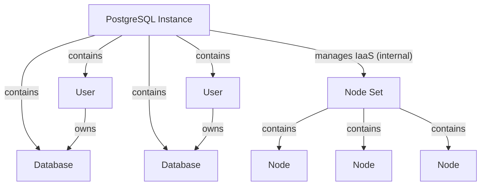

# PostgreSQL Service API



## Overview

The PostgreSQL service provides a REST-based API for creating and managing PostgreSQL database instances. It supports high availability configurations with multiple nodes, automatic failover, and comprehensive user and database management.

## Core Components

- `PostgreSQL Instance`: A logical PostgreSQL database instance
- `Database`: Logical databases within the PostgreSQL instance
- `User`: Database users with authentication and permissions

### PostgreSQL Instance (PG)
The main PostgreSQL instance entity that manages:
- Status (NEW, IN_PROGRESS, ACTIVE, ERROR)
- Configuration parameters:
  - CPU cores (1-128)
  - RAM (512MB-1TB)
  - Disk size (8GB-1TB)
  - Node count (1-16)
  - Synchronous replica count (0-15)
- Version information
- Associated databases and users

### Database
Logical databases within the PostgreSQL instance:
- Database name validation (PostgreSQL identifier rules)
- Owner assignment (must be a valid user)
- Status management

### User
Database users for authentication and access control:
- Username validation (PostgreSQL role naming rules)
- Password management with SCRAM-SHA-256 hashing
- Status

### Internal (not visible to user)
#### Node Set
Infrastructure layer that manages the underlying compute resources:
- Multiple nodes for high availability
- Root disk with PostgreSQL image
- Data disk for database storage
- Automatic failover and replication

## API Structure

### Creating a PostgreSQL Instance

```json
{
  "name": "production-postgres",
  "description": "Production PostgreSQL database",
  "cpu": 4,
  "ram": 2048,
  "disk_size": 100,
  "nodes_number": 3,
  "sync_replica_number": 1,
  "version": "/v1/types/postgres/versions/VERSION_UUID"
}
```

### Creating a User

```json
{
  "name": "app_user",
  "description": "Application database user",
  "password": "secure_password_123"
}
```

### Creating a Database

```json
{
  "name": "app_database",
  "description": "Main application database",
  "owner": "/v1/types/postgres/instances/INSTANCE_UUID/users/USER_UUID"
}
```


## Validation Rules

### Instance Validation
- CPU must be between 1 and 128 cores
- RAM must be between 512MB and 1TB
- Disk size must be between 8GB and 1TB
- Node count must be between 1 and 16
- Synchronous replica count must be between 0 and 15
- Disk size shrink is not supported

### Database Validation
- Database names must follow PostgreSQL identifier rules:
  - Start with letter or underscore
  - Contain only letters, numbers, and underscores
  - Maximum length of 63 characters
- Database owner must be a valid user

### User Validation
- Usernames must follow PostgreSQL role naming rules:
  - Cannot start with "pg_", "dbaas_", or "postgres"
  - Start with letter or underscore
  - Contain only letters, numbers, underscores, and dollar signs
  - Maximum length of 63 characters
- Password must be between 8 and 99 characters

## Status Management

### Instance Status Lifecycle
1. **NEW**: Instance created, infrastructure provisioning started
2. **IN_PROGRESS**: Infrastructure being provisioned, PostgreSQL being installed
3. **ACTIVE**: Instance ready for use
4. **ERROR**: Provisioning or configuration failed

### Component Status
- Nodes: NEW → IN_PROGRESS → ACTIVE → ERROR
- Databases: NEW → ACTIVE → ERROR
- Users: NEW → ACTIVE → ERROR

## Element Manifest Example

Basic manifest for PostgreSQL instance:

```yaml
requirements:
  core:
    from_version: "0.0.0"
  dbaas:
    from_version: "0.0.0"

imports:
  pg18:
    element: "$dbaas"
    kind: "resource"
    link: "$dbaas.types.postgres.versions.$pg18"

resources:
  # Secret
  $core.secret.passwords:
    demo_db_password:
      name: demo_db_password
      description: "Demo password"

  # DBaaS
  $dbaas.types.postgres.instances:
    cluster_pg:
      name: demo-cluster
      nodes_number: 1
      project_id: "12345678-c625-4fee-81d5-f691897b8142"
      cpu: 1
      ram: 1024
      disk_size: 15
      sync_replica_number: 1
      nodes_number: 1
      version: $demo.imports.$pg18:uuid

  $dbaas.types.postgres.instances.$cluster_pg.users:
    demo_user:
      project_id: "12345678-c625-4fee-81d5-f691897b8142"
      name: demo_user
      password: $core.secret.passwords.$demo_db_password:value
      instance: $dbaas.types.postgres.instances.$cluster_pg:uuid

  $dbaas.types.postgres.instances.$cluster_pg.databases:
    demo_db:
      uuid: "6bdc9203-bef4-4c63-9476-7d9729c43e7f"
      project_id: "12345678-c625-4fee-81d5-f691897b8142"
      name: demo_db
      owner: $dbaas.types.postgres.instances.$cluster_pg.users.$demo_user:uuid
      instance: $dbaas.types.postgres.instances.$cluster_pg:uuid

  # Configs
  $core.config.configs:
    demo_db_pass_cfg:
      ...
      body:
        kind: "text"
        content: f"
        DB_USER=$dbaas.types.postgres.instances.$cluster_pg.users.$demo_user:name
        DB_PASS=$core.secret.passwords.$demo_db_password:value
        DB_NODES=$dbaas.types.postgres.instances.$cluster_pg:to_str(ipsv4)
        "
```

## PostgreSQL Versions API

### Version Management
The `/v1/types/postgres/versions/` endpoint provides access to available PostgreSQL versions and their configurations.

#### GET /v1/types/postgres/versions/
Retrieve a list of all available PostgreSQL versions.

**Response Format:**
```json
{
  "versions": [
    {
      "uuid": "version-uuid-here",
      "name": "PostgreSQL 15.4",
      "description": "PostgreSQL 15.4 with latest security patches",
      "image": "postgres:15.4",
      "created_at": "2024-01-15T10:30:00Z",
      "updated_at": "2024-01-15T10:30:00Z"
    },
    {
      "uuid": "version-uuid-here-2",
      "name": "PostgreSQL 14.10",
      "description": "PostgreSQL 14.10 LTS version",
      "image": "postgres:14.10",
      "created_at": "2024-01-15T10:30:00Z",
      "updated_at": "2024-01-15T10:30:00Z"
    }
  ]
}
```

#### GET /v1/types/postgres/versions/{uuid}
Retrieve details for a specific PostgreSQL version.

**Response Format:**
```json
{
  "uuid": "version-uuid-here",
  "name": "PostgreSQL 15.4",
  "description": "PostgreSQL 15.4 with latest security patches",
  "image": "postgres:15.4",
  "created_at": "2024-01-15T10:30:00Z",
  "updated_at": "2024-01-15T10:30:00Z"
}
```

#### Version Selection
When creating a PostgreSQL instance, you must specify a version using its UUID:

```json
{
  "name": "production-postgres",
  "version": "/v1/types/postgres/versions/VERSION_UUID"
}
```

### Version Properties
- **UUID**: Unique identifier for the version
- **Name**: Human-readable version name
- **Description**: Detailed description of the version
- **Image**: Docker image reference used for deployment
- **Created At**: Timestamp when version was added
- **Updated At**: Timestamp of last update

### Version Lifecycle
- Versions are managed by the system administrator
- New versions can be added as PostgreSQL releases are published
- Deprecated versions may be marked for removal but remain available for existing instances
- Version updates for existing instances are planned for future releases

## API Endpoints

### Instance Management
- `POST /v1/postgres/instances` - Create new instance
- `GET /v1/postgres/instances/{uuid}` - Get instance details
- `PUT /v1/postgres/instances/{uuid}` - Update instance
- `DELETE /v1/postgres/instances/{uuid}` - Delete instance

### Database Management
- `POST /v1/postgres/instances/{uuid}/databases` - Create database
- `GET /v1/postgres/instances/{uuid}/databases` - List databases
- `GET /v1/postgres/instances/{uuid}/databases/{db_uuid}` - Get database
- `DELETE /v1/postgres/instances/{uuid}/databases/{db_uuid}` - Delete database

### User Management
- `POST /v1/postgres/instances/{uuid}/users` - Create user
- `GET /v1/postgres/instances/{uuid}/users` - List users
- `GET /v1/postgres/instances/{uuid}/users/{user_uuid}` - Get user
- `DELETE /v1/postgres/instances/{uuid}/users/{user_uuid}` - Delete user

### Version Management
- `GET /v1/types/postgres/versions` - List all available versions
- `GET /v1/types/postgres/versions/{uuid}` - Get specific version details
